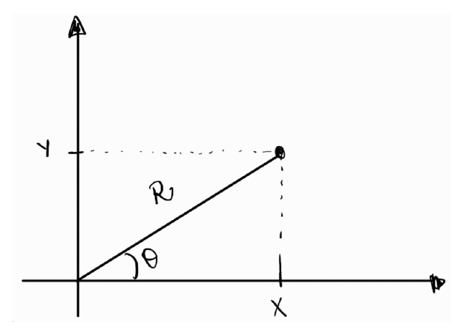

# Método de Box-Muller

No Capítulo 6 já geramos valores de uma $N(0,1)$ pelo método da rejeição:
propúnhamos uma $\text{Exp}(1)$, aceitávamos cerca de $76\%$ dos candidatos e
sorteávamos um sinal no final. O algoritmo funciona, mas cobra caro — são
necessários, em média, cerca de $3{,}6$ uniformes para cada normal produzida, e
há um laço que pode, em princípio, demorar.

Este capítulo apresenta um método que faz melhor: a partir de **exatamente dois**
uniformes, ele devolve **duas** normais padrão independentes, sem rejeitar nada.
É o método de Box-Muller, e ele é um caso particular do método da transformação
do capítulo anterior — com uma escolha de transformação que ninguém adivinharia
olhando apenas para a densidade da normal.

O truque é justamente esse: em vez de atacar uma normal de cada vez, atacamos
**duas ao mesmo tempo**.

## A ideia: olhar para o par, não para a coordenada

Por que olhar para duas normais ajudaria, se nem uma sabemos gerar por inversão?
Porque o **par** tem uma estrutura que a coordenada isolada não tem. Se
$X \sim N(0,1)$ e $Y \sim N(0,1)$ são independentes, a densidade conjunta é

$$
f_{X,Y}(x,y) = \frac{1}{\sqrt{2\pi}} e^{-x^2/2} \cdot
               \frac{1}{\sqrt{2\pi}} e^{-y^2/2} =
               \frac{1}{2\pi} e^{-(x^2 + y^2)/2}.
$$

Repare que $(x,y)$ aparece **somente** através de $x^2 + y^2$, ou seja, através da
distância do ponto à origem. Dois pontos que estejam à mesma distância da origem
têm exatamente a mesma densidade, não importa em que direção estejam. A nuvem de
pontos $(X, Y)$ é circularmente simétrica: não tem direção preferida.

E a maneira natural de descrever algo que só depende da distância à origem é
trocar as coordenadas cartesianas $(x,y)$ pelas **coordenadas polares**: a
distância $r$ e o ângulo $\theta$. É o que faremos a seguir — e a surpresa é que,
nessas coordenadas, as duas variáveis resultantes são fáceis de simular.

## Representação em coordenadas polares

Considere duas variáveis aleatórias $X \sim N(0, 1)$ e $Y \sim N(0, 1)$,
independentes entre si. No plano cartesiano, podemos representar o ponto $(X, Y)$
e descrevê-lo pelo par $(R, \Theta)$, em que $R$ é a distância do ponto à origem
e $\Theta$ é o ângulo formado com o eixo horizontal.



As relações trigonométricas para $\Theta$ são

$$
\sin \Theta = \frac{\text{cateto oposto}}{\text{hipotenusa}} = \frac{Y}{R}
\qquad \text{e} \qquad
\cos \Theta = \frac{\text{cateto adjacente}}{\text{hipotenusa}} = \frac{X}{R}.
$$

Dessa forma, obtemos as duas relações que usaremos o capítulo inteiro:

$$
X = R \cos \Theta, \qquad Y = R \sin \Theta,
\qquad \text{com} \qquad R^2 = X^2 + Y^2.
$$

## A distribuição de $R$ e $\Theta$

As variáveis $R$ e $\Theta$ são uma transformação do par $(X, Y)$. Para obter a
densidade conjunta de $(R, \Theta)$, usamos a fórmula de mudança de variáveis em
duas dimensões:

$$
f_{R, \Theta}(r, \theta) =
f_{X, Y}\big(h_1(r, \theta), h_2(r, \theta)\big)\, |J_h(r, \theta)|,
$$

em que $h_1(r,\theta) = r\cos\theta$ e $h_2(r,\theta) = r\sin\theta$ são as
transformações inversas (as que expressam $X$ e $Y$ em termos de $R$ e $\Theta$),
e $J_h$ é o Jacobiano dessas funções:

$$
J_h(r, \theta) =
\begin{vmatrix}
\frac{\partial h_1}{\partial r} & \frac{\partial h_1}{\partial \theta} \\
\frac{\partial h_2}{\partial r} & \frac{\partial h_2}{\partial \theta} \\
\end{vmatrix}
=
\begin{vmatrix}
\cos \theta & -r \sin \theta \\
\sin \theta & r \cos \theta \\
\end{vmatrix} = r(\cos^2 \theta + \sin^2 \theta) = r.
$$

::: {.callout-important title="Proposição: a versão polar de duas normais"}
Sejam $X$ e $Y$ independentes, ambas $N(0,1)$, e sejam $R \geq 0$ e
$\Theta \in (0, 2\pi)$ suas coordenadas polares. Então $R$ e $\Theta$ são
**independentes**, com

$$
\Theta \sim \text{Unif}(0, 2\pi)
\qquad \text{e} \qquad
R^2 \sim \text{Exp}(1/2).
$$
:::

::: {.callout-note collapse="true" title="Demonstração"}
Substituindo $f_{X,Y}(x,y) = \frac{1}{2\pi} e^{-(x^2+y^2)/2}$ na fórmula da
mudança de variáveis, e usando que
$(r\cos\theta)^2 + (r\sin\theta)^2 = r^2$, obtemos

$$
f_{R, \Theta}(r, \theta) = \frac{1}{2\pi} e^{-r^2/2}\, r
= \underbrace{\frac{1}{2\pi}}_{f_\Theta(\theta)} \cdot
  \underbrace{r e^{-r^2/2}}_{f_R(r)},
\qquad 0 < r < \infty, \; 0 < \theta < 2\pi.
$$

A densidade conjunta **fatorou** em um termo que só depende de $\theta$ e outro
que só depende de $r$: é exatamente isso que significa $R$ e $\Theta$ serem
independentes. Como cada fator é uma densidade legítima em seu domínio, lemos
diretamente que

$$
f_{\Theta}(\theta) = \frac{1}{2\pi}, \quad 0 < \theta < 2\pi,
\qquad \text{e} \qquad
f_R(r) = r e^{-r^2/2}, \quad r > 0,
$$

isto é, $\Theta \sim \text{Unif}(0, 2\pi)$ e $R \sim \text{Rayleigh}(1)$.

Falta passar de $R$ para $R^2$. Para $w > 0$,

$$
\mathbb{P}(R^2 \leq w) = \mathbb{P}(R \leq \sqrt{w}) =
\int_0^{\sqrt{w}} r e^{-r^2/2}\, dr = 1 - e^{-w/2},
$$

que é a f.d.a. de uma $\text{Exp}(1/2)$ (exponencial de **taxa** $1/2$, e
portanto de média $2$). $\square$
:::

::: {.callout-note title="Rayleigh, qui-quadrado e exponencial"}
A distribuição de $R$ tem nome: $\text{Rayleigh}(1)$. E a de $R^2$ tem dois: como
$R^2 = X^2 + Y^2$ é a soma dos quadrados de duas normais padrão independentes,
pela definição do Capítulo 7 temos $R^2 \sim \chi^2_2$. A demonstração acima
mostra que essa $\chi^2_2$ é a mesma coisa que uma $\text{Exp}(1/2)$ — fato que
também aparece no Exercício 12 do Capítulo 7, por outro caminho.

Não é uma coincidência sem graça: é justamente ela que torna o método viável,
porque exponenciais nós sabemos gerar por inversão desde o Capítulo 4.
:::

## O algoritmo

A proposição acima descreve o caminho de ida: **das** normais **para** as
coordenadas polares. O método de Box-Muller percorre esse caminho ao contrário.
Se conseguirmos gerar $R$ e $\Theta$ com as distribuições certas, as fórmulas
$X = R\cos\Theta$ e $Y = R\sin\Theta$ nos devolvem o par de normais.

E gerar $R$ e $\Theta$ é fácil, porque as duas são independentes e cada uma sai
de um único uniforme:

- $\Theta \sim \text{Unif}(0, 2\pi)$ é apenas uma mudança de escala:
  $\Theta = 2\pi U_2$;
- $R^2 \sim \text{Exp}(1/2)$ sai por inversão (Capítulo 4): como
  $F(w) = 1 - e^{-w/2}$, temos $R^2 = -2\log(1 - U_1)$, ou, trocando $1-U_1$ por
  $U_1$ (a mesma observação feita no Capítulo 7), $R^2 = -2 \log U_1$. Daí
  $R = \sqrt{-2\log U_1}$.

::: {.callout-tip title="Pseudo-algoritmo: Box-Muller"}
1. Gere $U_1 \sim \text{Unif}(0,1)$ e $U_2 \sim \text{Unif}(0,1)$, independentes.

2. Calcule o raio $R = \sqrt{-2 \log U_1}$ e o ângulo $\Theta = 2\pi U_2$.

3. Devolva o par

$$
X = R \cos \Theta = \sqrt{-2 \log U_1} \, \cos(2\pi U_2),
\qquad
Y = R \sin \Theta = \sqrt{-2 \log U_1} \, \sin(2\pi U_2).
$$
:::

::: {.callout-important title="Proposição: validade do método"}
As variáveis $X$ e $Y$ devolvidas pelo algoritmo são independentes e ambas têm
distribuição $N(0,1)$.
:::

::: {.callout-note collapse="true" title="Demonstração"}
O passo 2 produz $\Theta \sim \text{Unif}(0,2\pi)$ e $R^2 \sim \text{Exp}(1/2)$,
independentes (porque $U_1$ e $U_2$ o são). Logo, o par $(R, \Theta)$ gerado tem
exatamente a densidade conjunta

$$
f_{R,\Theta}(r,\theta) = \frac{1}{2\pi}\, r e^{-r^2/2}
$$

obtida na proposição anterior.

Falta ver que aplicar $x = r\cos\theta$, $y = r\sin\theta$ a esse par devolve a
densidade conjunta de duas normais padrão. Usamos de novo a fórmula de mudança de
variáveis, agora no sentido contrário: o Jacobiano da transformação que leva
$(x,y)$ em $(r,\theta)$ é o inverso do anterior, ou seja, $1/r$. Como
$r = \sqrt{x^2+y^2}$,

$$
f_{X,Y}(x,y) = f_{R,\Theta}(r, \theta) \cdot \frac{1}{r}
= \frac{1}{2\pi}\, r e^{-r^2/2} \cdot \frac{1}{r}
= \frac{1}{2\pi} e^{-(x^2+y^2)/2}
= \frac{e^{-x^2/2}}{\sqrt{2\pi}} \cdot \frac{e^{-y^2/2}}{\sqrt{2\pi}}.
$$

A densidade conjunta fatorou no produto de duas densidades $N(0,1)$, o que
significa que $X$ e $Y$ são independentes e cada uma é $N(0,1)$. $\square$
:::

Vale registrar o que o método tem de notável: ele é **exato** (não é uma
aproximação, como somar doze uniformes e apelar para o Teorema Central do
Limite), **não rejeita nada** (todo par de uniformes vira um par de normais) e
consome exatamente **um uniforme por normal gerada** — contra os $3{,}6$ do
método da rejeição do Capítulo 6.

::: {.callout-warning title="Atenção: três armadilhas de implementação"}
- **`log` é logaritmo natural** tanto em R quanto em Python (`np.log`). Se você
  usar `log10`, o método simplesmente gera outra distribuição, sem dar erro.

- **Os senos e cossenos estão em radianos.** É por isso que $\Theta = 2\pi U_2$
  entra direto em `cos()` e `sin()`, sem conversão para graus.

- **$U_1$ não pode valer $0$**, senão $\log U_1 = -\infty$ e o algoritmo devolve
  `Inf` ou `NaN`. O `runif` do R e o `np.random.uniform` do Python não devolvem
  esse valor na prática, mas um gerador escrito por você (como o LCG do
  Capítulo 2) pode devolver — veja o Exercício 11.

- Em Python, `^` **não** é exponenciação: use `**`. Escrever `V1^2` não dá erro,
  mas calcula um "ou exclusivo" bit a bit.
:::

## Exemplo 1: gerando normais padrão

O código abaixo implementa o pseudo-algoritmo em uma função que devolve $B$
pares. Como cada par traz duas normais, geramos $B = 2500$ pares para obter
$5000$ valores.

Além de comparar o histograma com a densidade da $N(0,1)$, fazemos duas
conferências que dizem respeito ao par: a correlação entre $X$ e $Y$ (que deve
ser próxima de zero) e o gráfico de dispersão dos pares, que deve exibir a nuvem
circular discutida no início do capítulo.

::: {.panel-tabset group="language"}
# R

```{r}
library(ggplot2)

set.seed(42)

# Gera B pares de normais padrão pelo método de Box-Muller.
# Devolve um data.frame com colunas x e y: cada linha é um par (X, Y)
box_muller <- function(B) {
  X <- numeric(B)
  Y <- numeric(B)

  for (i in 1:B) {
    # Passo 1: dois uniformes independentes
    U1 <- runif(1)
    U2 <- runif(1)

    # Passo 2: o raio e o ângulo. Em R, log() é o logaritmo natural
    R <- sqrt(-2 * log(U1))
    Theta <- 2 * pi * U2

    # Passo 3: de coordenadas polares de volta para as cartesianas.
    # cos e sin esperam o ângulo em radianos, que é o que Theta já é
    X[i] <- R * cos(Theta)
    Y[i] <- R * sin(Theta)
  }

  return(data.frame(x = X, y = Y))
}

B <- 2500   # número de PARES: no fim teremos 2 * B = 5000 valores normais
pares <- box_muller(B)

cat("X: média", round(mean(pares$x), 3),
    "e desvio padrão", round(sd(pares$x), 3), "\n")
cat("Y: média", round(mean(pares$y), 3),
    "e desvio padrão", round(sd(pares$y), 3), "\n")
cat("Correlação entre X e Y:", round(cor(pares$x, pares$y), 3), "\n")

# As duas colunas juntas: 2B valores, todos N(0,1)
df <- data.frame(z = c(pares$x, pares$y))

ggplot(df, aes(x = z)) +
  geom_histogram(aes(y = after_stat(density)), bins = 40,
                 fill = "skyblue", color = "black") +
  stat_function(fun = dnorm, color = "red", linewidth = 1) +
  labs(title = "5000 valores gerados por Box-Muller",
       x = "Valor gerado", y = "Densidade") +
  theme_minimal()
```

```{r}
# coord_fixed deixa as duas escalas iguais: sem isso, um círculo pareceria
# uma elipse
ggplot(pares, aes(x = x, y = y)) +
  geom_point(alpha = 0.3, size = 0.8, color = "steelblue") +
  coord_fixed() +
  labs(title = "Os pares (X, Y) formam uma nuvem circular",
       x = "X", y = "Y") +
  theme_minimal()
```

# Python

```{python}
import numpy as np
import matplotlib.pyplot as plt
from scipy.stats import norm

np.random.seed(42)

# Gera B pares de normais padrão pelo método de Box-Muller.
# Devolve dois vetores de tamanho B: o i-ésimo par é (X[i], Y[i])
def box_muller(B):
    X = np.zeros(B)
    Y = np.zeros(B)

    for i in range(B):
        # Passo 1: dois uniformes independentes
        U1 = np.random.uniform(0, 1)
        U2 = np.random.uniform(0, 1)

        # Passo 2: o raio e o ângulo. np.log é o logaritmo natural
        R = np.sqrt(-2 * np.log(U1))
        Theta = 2 * np.pi * U2

        # Passo 3: de coordenadas polares de volta para as cartesianas.
        # cos e sin esperam o ângulo em radianos, que é o que Theta já é
        X[i] = R * np.cos(Theta)
        Y[i] = R * np.sin(Theta)

    return X, Y


B = 2500   # número de PARES: no fim teremos 2 * B = 5000 valores normais
X, Y = box_muller(B)

print("X: média", round(X.mean(), 3),
      "e desvio padrão", round(X.std(ddof=1), 3))
print("Y: média", round(Y.mean(), 3),
      "e desvio padrão", round(Y.std(ddof=1), 3))
print("Correlação entre X e Y:", round(np.corrcoef(X, Y)[0, 1], 3))

# Os dois vetores juntos: 2B valores, todos N(0,1)
Z = np.concatenate([X, Y])

# Malha usada só para desenhar a densidade teórica
grade = np.linspace(-4, 4, 400)

plt.figure(figsize=(8, 5))
plt.hist(Z, bins=40, density=True, color="skyblue", edgecolor="black")
plt.plot(grade, norm.pdf(grade), color="red", linewidth=2)
plt.title("5000 valores gerados por Box-Muller")
plt.xlabel("Valor gerado")
plt.ylabel("Densidade")
plt.show()
```

```{python}
# set_aspect deixa as duas escalas iguais: sem isso, um círculo pareceria
# uma elipse
plt.figure(figsize=(6, 6))
plt.scatter(X, Y, alpha=0.3, s=8, color="steelblue")
plt.gca().set_aspect("equal")
plt.title("Os pares (X, Y) formam uma nuvem circular")
plt.xlabel("X")
plt.ylabel("Y")
plt.show()
```

:::

## Exemplo 2: de $N(0,1)$ para $N(\mu, \sigma^2)$

O método entrega normais **padrão**, mas na prática quase sempre queremos uma
normal com média e variância dadas. A ponte é uma transformação afim, que já é um
uso do método do Capítulo 7.

::: {.callout-important title="Proposição"}
Se $Z \sim N(0,1)$, então $X = \mu + \sigma Z \sim N(\mu, \sigma^2)$, para
quaisquer $\mu \in \mathbb{R}$ e $\sigma > 0$.
:::

::: {.callout-note collapse="true" title="Demonstração"}
A função $g(z) = \mu + \sigma z$ é estritamente crescente (pois $\sigma > 0$),
com inversa $g^{-1}(x) = (x - \mu)/\sigma$. Pela fórmula da densidade de uma
transformação monótona (Capítulo 7),

$$
f_X(x) = f_Z\left(\frac{x-\mu}{\sigma}\right) \cdot \frac{1}{\sigma}
= \frac{1}{\sigma\sqrt{2\pi}}\,
  e^{-\frac{1}{2}\left(\frac{x-\mu}{\sigma}\right)^2},
$$

que é a densidade da $N(\mu, \sigma^2)$. $\square$
:::

Note que $\sigma$ é o **desvio padrão**, não a variância: essa é uma fonte
frequente de erro, agravada pelo fato de que R e Python discordam da notação
usual — `rnorm` e `np.random.normal` pedem o desvio padrão, enquanto a notação
$N(\mu, \sigma^2)$ exibe a variância.

Vamos simular alturas de uma população adulta, modeladas por uma
$N(170, 8^2)$ (em centímetros), usando a função `box_muller` do Exemplo 1.

::: {.panel-tabset group="language"}
# R

```{r}
set.seed(2024)

mu <- 170     # média desejada
sigma <- 8    # desvio padrão desejado

pares <- box_muller(2500)
Z <- c(pares$x, pares$y)   # 5000 valores N(0,1)

# A transformação afim que desloca e reescala
X <- mu + sigma * Z

cat("Média amostral:", round(mean(X), 2), " (teórica:", mu, ")\n")
cat("Desvio padrão amostral:", round(sd(X), 2), " (teórico:", sigma, ")\n")
cat("Proporção de valores acima de 186 cm:", round(mean(X > 186), 4), "\n")
cat("Valor teórico:", round(1 - pnorm(186, mean = mu, sd = sigma), 4), "\n")

ggplot(data.frame(x = X), aes(x = x)) +
  geom_histogram(aes(y = after_stat(density)), bins = 40,
                 fill = "lightgreen", color = "black") +
  stat_function(fun = function(x) dnorm(x, mean = mu, sd = sigma),
                color = "red", linewidth = 1) +
  labs(title = "N(170, 64) obtida deslocando e reescalando normais padrão",
       x = "Altura (cm)", y = "Densidade") +
  theme_minimal()
```

# Python

```{python}
np.random.seed(2024)

mu = 170      # média desejada
sigma = 8     # desvio padrão desejado

X1, Y1 = box_muller(2500)
Z = np.concatenate([X1, Y1])   # 5000 valores N(0,1)

# A transformação afim que desloca e reescala
X = mu + sigma * Z

print("Média amostral:", round(X.mean(), 2), " (teórica:", mu, ")")
print("Desvio padrão amostral:", round(X.std(ddof=1), 2),
      " (teórico:", sigma, ")")
print("Proporção de valores acima de 186 cm:", round(np.mean(X > 186), 4))
print("Valor teórico:", round(1 - norm.cdf(186, loc=mu, scale=sigma), 4))

# Malha usada só para desenhar a densidade teórica
grade = np.linspace(X.min(), X.max(), 400)

plt.figure(figsize=(8, 5))
plt.hist(X, bins=40, density=True, color="lightgreen", edgecolor="black")
plt.plot(grade, norm.pdf(grade, loc=mu, scale=sigma), color="red", linewidth=2)
plt.title("N(170, 64) obtida deslocando e reescalando normais padrão")
plt.xlabel("Altura (cm)")
plt.ylabel("Densidade")
plt.show()
```

:::

## Exemplo 3: um par de normais correlacionadas

Até aqui tratamos as duas normais devolvidas pelo método como valores separados.
Mas há situações em que queremos justamente um **par** — duas medidas do mesmo
indivíduo, como peso e altura, que não são independentes. Nesses casos, o fato de
o Box-Muller já produzir pares é uma conveniência e tanto.

Queremos gerar $(X, Y)$ com distribuição normal bivariada, ambas com média $0$ e
variância $1$, e com $\text{corr}(X,Y) = \rho$. A construção é uma transformação
do par de normais independentes $(Z_1, Z_2)$:

$$
X = Z_1, \qquad Y = \rho Z_1 + \sqrt{1 - \rho^2}\, Z_2.
$$

A intuição é que $Y$ empresta uma fração $\rho$ do valor de $X$ e completa o
resto com ruído independente; o coeficiente $\sqrt{1-\rho^2}$ é exatamente o que
faz a variância de $Y$ voltar a valer $1$:

$$
\text{Var}(Y) = \rho^2 \text{Var}(Z_1) + (1 - \rho^2)\text{Var}(Z_2) = 1,
\qquad
\text{Cov}(X, Y) = \rho\, \text{Var}(Z_1) = \rho.
$$

::: {.callout-tip title="Pseudo-algoritmo: normal bivariada com correlação $\rho$"}
1. Gere $Z_1$ e $Z_2$ independentes, ambas $N(0,1)$, por Box-Muller.

2. Devolva $X = Z_1$ e $Y = \rho Z_1 + \sqrt{1-\rho^2}\, Z_2$.
:::

Como conferência, além da correlação amostral, comparamos a proporção de pontos
no primeiro quadrante com o valor teórico, que para a normal bivariada padrão é

$$
\mathbb{P}(X > 0, Y > 0) = \frac{1}{4} + \frac{\arcsin \rho}{2\pi}.
$$

Quando $\rho = 0$ essa expressão vale $1/4$, como esperado para variáveis
independentes e simétricas; quanto maior $\rho$, mais os pontos se concentram nos
quadrantes em que $X$ e $Y$ têm o mesmo sinal.

::: {.panel-tabset group="language"}
# R

```{r}
set.seed(7)

rho <- 0.8   # correlação desejada
B <- 2000

pares <- box_muller(B)
Z1 <- pares$x
Z2 <- pares$y

# X é a primeira normal; Y mistura as duas para criar a correlação
X <- Z1
Y <- rho * Z1 + sqrt(1 - rho^2) * Z2

cat("Correlação amostral:", round(cor(X, Y), 3), " (teórica:", rho, ")\n")
cat("Desvio padrão de Y:", round(sd(Y), 3), " (teórico: 1)\n")

prob_teorica <- 1 / 4 + asin(rho) / (2 * pi)
cat("P(X > 0 e Y > 0) observada:", round(mean(X > 0 & Y > 0), 4), "\n")
cat("P(X > 0 e Y > 0) teórica:", round(prob_teorica, 4), "\n")

ggplot(data.frame(x = X, y = Y), aes(x = x, y = y)) +
  geom_point(alpha = 0.3, size = 0.8, color = "darkorange") +
  coord_fixed() +
  labs(title = "Normal bivariada com correlação 0,8",
       x = "X", y = "Y") +
  theme_minimal()
```

# Python

```{python}
np.random.seed(7)

rho = 0.8   # correlação desejada
B = 2000

Z1, Z2 = box_muller(B)

# X é a primeira normal; Y mistura as duas para criar a correlação
X = Z1
Y = rho * Z1 + np.sqrt(1 - rho**2) * Z2

print("Correlação amostral:", round(np.corrcoef(X, Y)[0, 1], 3),
      " (teórica:", rho, ")")
print("Desvio padrão de Y:", round(Y.std(ddof=1), 3), " (teórico: 1)")

prob_teorica = 1 / 4 + np.arcsin(rho) / (2 * np.pi)
print("P(X > 0 e Y > 0) observada:", round(np.mean((X > 0) & (Y > 0)), 4))
print("P(X > 0 e Y > 0) teórica:", round(prob_teorica, 4))

plt.figure(figsize=(6, 6))
plt.scatter(X, Y, alpha=0.3, s=8, color="darkorange")
plt.gca().set_aspect("equal")
plt.title("Normal bivariada com correlação 0,8")
plt.xlabel("X")
plt.ylabel("Y")
plt.show()
```

:::

Compare este gráfico com o do Exemplo 1: a nuvem deixou de ser circular e virou
uma elipse inclinada. A simetria que motivou o capítulo inteiro é uma propriedade
de normais **independentes** e de mesma variância; quando elas se correlacionam,
as coordenadas polares deixam de ajudar.

## O método polar de Marsaglia

O Box-Muller tem um custo escondido: cada par exige um logaritmo, uma raiz, um
seno e um cosseno. Funções trigonométricas são caras — historicamente, bem mais
caras que uma rejeição ocasional. Marsaglia propôs uma variante que produz
exatamente a mesma distribuição sem calcular nenhum seno ou cosseno, ao preço de
descartar alguns candidatos. É um híbrido bonito dos dois métodos: rejeição para
sortear a direção, transformação para gerar o raio.

A ideia é que não precisamos do **ângulo**; precisamos apenas de seu seno e seu
cosseno. E um ângulo uniforme com seu seno e cosseno é o que se obtém sorteando
um ponto uniformemente dentro do círculo de raio $1$: se $(V_1, V_2)$ é esse
ponto e $S = V_1^2 + V_2^2$, então

$$
\cos \Theta = \frac{V_1}{\sqrt{S}}
\qquad \text{e} \qquad
\sin \Theta = \frac{V_2}{\sqrt{S}},
$$

sem nunca calcular $\Theta$. Sortear um ponto uniforme no círculo, por sua vez, é
um caso do método da rejeição do Capítulo 6: sorteia-se um ponto no quadrado
$[-1,1] \times [-1,1]$ e descarta-se quem cair fora do círculo.

O que fecha o método é um fato menos óbvio: condicionado à aceitação, $S$ é
$\text{Unif}(0,1)$ e é **independente** do ângulo. Logo, o próprio $S$ pode fazer
o papel do $U_1$ do Box-Muller, e nenhum uniforme extra é necessário para o raio.

::: {.callout-tip title="Pseudo-algoritmo: método polar"}
1. Gere $V_1, V_2 \sim \text{Unif}(-1, 1)$ independentes, e faça
   $S = V_1^2 + V_2^2$.

2. Se $S \geq 1$ ou $S = 0$, volte ao passo 1 (o ponto caiu fora do círculo).

3. Devolva o par

$$
X = V_1 \sqrt{\frac{-2 \log S}{S}},
\qquad
Y = V_2 \sqrt{\frac{-2 \log S}{S}}.
$$
:::

O fator $\sqrt{-2\log S}$ é o raio $R$, exatamente como no Box-Muller; a divisão
extra por $\sqrt{S}$ é o que normaliza $(V_1, V_2)$ para virar $(\cos\Theta,
\sin\Theta)$.

Como a área do círculo de raio $1$ é $\pi$ e a do quadrado é $4$, a taxa de
aceitação é $\pi/4 \approx 0{,}785$: descartamos cerca de um em cada cinco pares.

::: {.panel-tabset group="language"}
# R

```{r}
set.seed(42)

B <- 2500
X <- numeric(B)
Y <- numeric(B)
n_sorteios <- 0   # conta quantos pares (V1, V2) foram sorteados ao todo
i <- 1

while (i <= B) {
  # Passo 1: um ponto uniforme no quadrado [-1, 1] x [-1, 1]
  V1 <- runif(1, min = -1, max = 1)
  V2 <- runif(1, min = -1, max = 1)
  n_sorteios <- n_sorteios + 1

  S <- V1^2 + V2^2

  # Passo 2: só aceitamos os pontos que caíram dentro do círculo de raio 1
  if (S < 1 && S > 0) {
    # Passo 3: o fator comum faz o papel de R / sqrt(S)
    fator <- sqrt(-2 * log(S) / S)
    X[i] <- V1 * fator
    Y[i] <- V2 * fator
    i <- i + 1
  }
}

cat("Pares sorteados:", n_sorteios, "para", B, "aceitos\n")
cat("Taxa de aceitação observada:", round(B / n_sorteios, 3), "\n")
cat("Taxa de aceitação teórica (pi/4):", round(pi / 4, 3), "\n")
cat("Média e desvio padrão de X:", round(mean(X), 3), round(sd(X), 3), "\n")

df <- data.frame(z = c(X, Y))

ggplot(df, aes(x = z)) +
  geom_histogram(aes(y = after_stat(density)), bins = 40,
                 fill = "lightcoral", color = "black") +
  stat_function(fun = dnorm, color = "red", linewidth = 1) +
  labs(title = "5000 valores gerados pelo método polar",
       x = "Valor gerado", y = "Densidade") +
  theme_minimal()
```

# Python

```{python}
np.random.seed(42)

B = 2500
X = np.zeros(B)
Y = np.zeros(B)
n_sorteios = 0   # conta quantos pares (V1, V2) foram sorteados ao todo
i = 0

while i < B:
    # Passo 1: um ponto uniforme no quadrado [-1, 1] x [-1, 1]
    V1 = np.random.uniform(-1, 1)
    V2 = np.random.uniform(-1, 1)
    n_sorteios += 1

    S = V1**2 + V2**2

    # Passo 2: só aceitamos os pontos que caíram dentro do círculo de raio 1
    if S < 1 and S > 0:
        # Passo 3: o fator comum faz o papel de R / sqrt(S)
        fator = np.sqrt(-2 * np.log(S) / S)
        X[i] = V1 * fator
        Y[i] = V2 * fator
        i += 1

print("Pares sorteados:", n_sorteios, "para", B, "aceitos")
print("Taxa de aceitação observada:", round(B / n_sorteios, 3))
print("Taxa de aceitação teórica (pi/4):", round(np.pi / 4, 3))
print("Média e desvio padrão de X:", round(X.mean(), 3),
      round(X.std(ddof=1), 3))

Z = np.concatenate([X, Y])
grade = np.linspace(-4, 4, 400)

plt.figure(figsize=(8, 5))
plt.hist(Z, bins=40, density=True, color="lightcoral", edgecolor="black")
plt.plot(grade, norm.pdf(grade), color="red", linewidth=2)
plt.title("5000 valores gerados pelo método polar")
plt.xlabel("Valor gerado")
plt.ylabel("Densidade")
plt.show()
```

:::

::: {.callout-note title="E o que R e Python usam de verdade?"}
Nenhum dos dois usa o Box-Muller por padrão. O R gera normais por **inversão** da
f.d.a., com uma aproximação numérica muito precisa de $\Phi^{-1}$: rode
`RNGkind()` e veja `"Inversion"` na segunda posição. (Dá para pedir o Box-Muller
com `RNGkind(normal.kind = "Box-Muller")`.)

Já o gerador legado do NumPy — o `np.random.normal` que usamos no livro inteiro —
implementa exatamente o **método polar** desta seção. A API mais nova
(`np.random.default_rng`) usa um terceiro algoritmo, o *ziggurat*, mais rápido e
bem mais complicado de explicar.
:::

## Exercícios

<span style="color:#2C92B2;">**Exercício 1**</span>. Implemente o método de
Box-Muller em uma função que receba $B$ e devolva $B$ pares de valores
independentes com distribuição $N(0,1)$.

(a) Gere $B = 5000$ pares e faça o histograma dos $10\,000$ valores obtidos,
sobrepondo a densidade da $N(0,1)$.

(b) Faça um gráfico quantil-quantil (`qqnorm` seguido de `qqline` em R,
`scipy.stats.probplot` em Python) e comente o que ele mostra nas caudas.

(c) Verifique a independência do par de três maneiras: calcule a correlação
amostral, faça o gráfico de dispersão e compare a proporção de pontos em cada um
dos quatro quadrantes com $1/4$.

(d) Estime $\mathbb{P}(|X| > 1{,}96)$ e compare com o valor teórico $0{,}05$.

<span style="color:#2C92B2;">**Exercício 2**</span>. Este exercício verifica, na
mão, os fatos sobre $R$ usados no capítulo. Lembre que $f_R(r) = re^{-r^2/2}$
para $r > 0$.

(a) Mostre que a f.d.a. de $R$ é $F_R(r) = 1 - e^{-r^2/2}$ e que, portanto,
$R^2 \sim \text{Exp}(1/2)$.

(b) Mostre, invertendo $F_R$, que $R = \sqrt{-2\log(1-U)}$ com
$U \sim \text{Unif}(0,1)$. Conclua que o passo 2 do Box-Muller é o método da
inversão aplicado à Rayleigh.

(c) Verifique que $\mathbb{E}[R^2] = 2$, coerente com $R^2 \sim \chi^2_2$, e que
$\mathbb{E}[R] = \sqrt{\pi/2}$.

(d) Gere $B = 5000$ valores de $R$ (você pode usar o Box-Muller e calcular
$\sqrt{X^2+Y^2}$, ou gerar $R$ diretamente pelo item (b)) e compare o histograma
com $f_R$. Compare também as médias amostrais de $R$ e $R^2$ com os valores do
item (c).

<span style="color:#2C92B2;">**Exercício 3**</span>. A partir das normais padrão
do Exercício 1:

(a) Gere $B = 5000$ valores de uma $N(-2, 9)$ e compare o histograma com a
densidade teórica. Cuidado: $9$ é a variância.

(b) A distribuição **log-normal** é a de $W = e^{X}$, com
$X \sim N(\mu, \sigma^2)$; ela é muito usada para modelar salários e preços, que
são positivos e assimétricos. Gere $B = 5000$ valores de $W$ com $\mu = 0$ e
$\sigma = 1$ e compare o histograma com a densidade da log-normal (`dlnorm` em R,
`scipy.stats.lognorm.pdf(x, s=sigma)` em Python).

(c) Estime $\mathbb{E}[W]$ e compare com $e^{\mu}$ e com
$e^{\mu + \sigma^2/2}$. Qual dos dois é o valor correto? Explique por que
$\mathbb{E}[e^X] \neq e^{\mathbb{E}[X]}$.

(d) Compare a média e a mediana amostrais de $W$. Por que elas são tão
diferentes, se para $X$ elas coincidem?

<span style="color:#2C92B2;">**Exercício 4**</span>. Continuando o Exemplo 3.

(a) Verifique, por conta própria, que $\text{Var}(Y) = 1$ e
$\text{Cov}(X,Y) = \rho$ para $X = Z_1$ e
$Y = \rho Z_1 + \sqrt{1-\rho^2}Z_2$.

(b) Gere $B = 2000$ pares para $\rho = -0{,}9$, $\rho = 0$ e $\rho = 0{,}9$, e
faça os três gráficos de dispersão lado a lado. Descreva como a nuvem muda.

(c) Para cada um dos três valores de $\rho$, estime
$\mathbb{P}(X > 0, Y > 0)$ e compare com
$1/4 + \arcsin(\rho)/(2\pi)$.

(d) Adapte a construção para gerar um par com médias $\mu_1, \mu_2$ e desvios
padrão $\sigma_1, \sigma_2$ quaisquer. Gere $B = 2000$ pares "peso e altura" com
$\mu = (70, 170)$, $\sigma = (12, 8)$ e $\rho = 0{,}6$, e confira as médias, os
desvios e a correlação amostrais.

(e) O Exemplo 5 do Capítulo 7 gera vetores normais em dimensão qualquer,
transformando um vetor $Z$ de normais padrão em $LZ$, com $\Sigma = LL^{\top}$.
Verifique que, em dimensão $2$, as duas construções são exatamente a mesma:
calcule a decomposição de Cholesky de
$$
\Sigma = \begin{pmatrix} 1 & \rho \\ \rho & 1 \end{pmatrix}
$$
(com `t(chol(Sigma))` em R e `np.linalg.cholesky` em Python) e confira que a
matriz obtida é
$$
L = \begin{pmatrix} 1 & 0 \\ \rho & \sqrt{1-\rho^2} \end{pmatrix},
$$
de modo que $LZ$ reproduz linha por linha as fórmulas de $X$ e $Y$ usadas neste
exemplo.

<span style="color:#2C92B2;">**Exercício 5**</span>. A mesma mudança de variáveis
do capítulo resolve uma integral famosa. Seja
$I = \int_{-\infty}^{\infty} e^{-x^2/2}\, dx$.

(a) Escreva $I^2$ como a integral dupla
$\int\int e^{-(x^2+y^2)/2}\, dx\, dy$ e passe para coordenadas polares, lembrando
que o elemento de área vira $r\, dr\, d\theta$ — o mesmo Jacobiano da seção sobre
a distribuição de $R$ e $\Theta$.

(b) Conclua que $I = \sqrt{2\pi}$, isto é, que a constante que aparece na
densidade da normal é exatamente a que a faz integrar $1$.

(c) Confira o resultado numericamente (`integrate` em R,
`scipy.integrate.quad` em Python).

(d) Em uma frase: qual é a relação entre esse cálculo e o método de Box-Muller?

<span style="color:#2C92B2;">**Exercício 6**</span>. Sobre o método polar.

(a) Implemente-o em uma função e verifique, com $B = 5000$ pares, que os valores
gerados são $N(0,1)$ e que a correlação entre as duas coordenadas é próxima de
zero.

(b) Registre a proporção de pares aceitos e compare com $\pi/4$. Use essa
proporção para estimar $\pi$: por que $4 \times (\text{taxa de aceitação})$ é uma
estimativa de $\pi$?

(c) Guarde os valores de $S$ dos pares **aceitos** e faça o histograma. Ele é
compatível com uma $\text{Unif}(0,1)$? Explique geometricamente por que
$\mathbb{P}(S \leq s \mid S < 1) = s$ para $0 < s < 1$ (dica: compare áreas de
círculos).

(d) Quantos uniformes o método consome, em média, por normal gerada? Compare com
o $1$ do Box-Muller e com o $3{,}6$ do método da rejeição do Capítulo 6.

<span style="color:#2C92B2;">**Exercício 7**</span>. Agora temos três geradores de
normais: a rejeição do Capítulo 6, o Box-Muller e o método polar.

(a) Meça o tempo que cada um leva para gerar $10^5$ valores (`system.time` em R,
`time.time` em Python). Rode cada medição algumas vezes: os tempos variam.

(b) Compare com o tempo das funções prontas `rnorm` e `np.random.normal`. A
diferença é grande? O que ela sugere sobre a implementação dessas funções?

(c) Em R, rode `RNGkind()` e descubra qual método o `rnorm` usa por padrão. Em
seguida troque para `RNGkind(normal.kind = "Box-Muller")`, gere uma amostra e
confira que continua sendo normal. Volte ao padrão com
`RNGkind(normal.kind = "Inversion")` ao final.

(d) O método polar rejeita cerca de $21\%$ dos pares, mas costuma ser mais rápido
que o Box-Muller. Como isso é possível?

<span style="color:#2C92B2;">**Exercício 8**</span>. Um erro tentador é
economizar um uniforme, usando o **mesmo** $U$ nas duas fórmulas:

$$
X = \sqrt{-2 \log U} \, \cos(2\pi U),
\qquad
Y = \sqrt{-2 \log U} \, \sin(2\pi U).
$$

(a) Gere $B = 2000$ pares assim e faça o gráfico de dispersão de $(X, Y)$. O que
aconteceu com a nuvem circular?

(b) Calcule a correlação amostral entre $X$ e $Y$ e o desvio padrão de cada uma.
Faça o histograma de $X$ sozinho e compare com a densidade da $N(0,1)$: o defeito
aparece de forma tão evidente quanto no gráfico de dispersão?

(c) Qual hipótese da proposição de validade do método foi violada? Responda em
termos de $R$ e $\Theta$.

(d) Conclua que olhar apenas para o histograma de $X$ é insuficiente para atestar
que um gerador de **pares** está correto. Que gráfico você faria primeiro, ao
desconfiar de um gerador desse tipo?

<span style="color:#2C92B2;">**Exercício 9**</span>. Um dardo é atirado em um
alvo. O erro horizontal $X$ e o erro vertical $Y$ (em centímetros, em relação ao
centro) são independentes e $N(0, \sigma^2)$, com $\sigma = 3$. A distância do
dardo ao centro é $D = \sqrt{X^2 + Y^2}$.

(a) Use o Box-Muller para gerar $B = 5000$ pares $(X,Y)$ e obtenha os valores
correspondentes de $D$.

(b) Pela teoria do capítulo, $D = \sigma R$ com $R \sim \text{Rayleigh}(1)$.
Mostre que $\mathbb{P}(D \leq d) = 1 - e^{-d^2/(2\sigma^2)}$ e compare essa
expressão com a f.d.a. empírica dos valores simulados.

(c) Estime a probabilidade de o dardo cair a menos de $2$ cm do centro e a
probabilidade de cair a mais de $6$ cm, comparando com os valores exatos do item
(b).

(d) Qual é a distância **mediana** ao centro? Compare o valor simulado com o
teórico $\sigma\sqrt{2\log 2}$.

(e) Note que $\mathbb{P}(D \leq d)$ cresce a partir de $0$ e que a densidade de
$D$ vale zero em $d = 0$: acertar exatamente o centro é o resultado *menos*
provável, mesmo sendo o centro o ponto de maior densidade de $(X,Y)$. Explique
essa aparente contradição.

<span style="color:#2C92B2;">**Exercício 10**</span>. (Desafio) Todo gerador
uniforme produz, na verdade, um número finito de valores distintos. Seja
$u_{\min}$ o menor valor estritamente positivo que o seu gerador pode devolver.

(a) Mostre que o Box-Muller nunca produz um valor com
$|X| > \sqrt{-2 \log u_{\min}}$, qualquer que seja $U_2$.

(b) Suponha $u_{\min} = 2^{-32}$ (resolução típica de um gerador de 32 bits) e
depois $u_{\min} = 2^{-53}$ (precisão de um `double`). Calcule o limite em cada
caso. A resposta está entre $6$ e $9$ desvios padrão.

(c) Calcule $\mathbb{P}(|X| > 6{,}66)$ para $X \sim N(0,1)$. Para quais
aplicações essa truncagem da cauda seria irrelevante, e para quais ela poderia
importar?

(d) Descubra experimentalmente se o `runif` do R (ou o `np.random.uniform` do
Python) pode devolver exatamente $0$: gere alguns milhões de valores e olhe o
mínimo. O que aconteceria com o algoritmo se ele devolvesse?

(e) O método polar sofre do mesmo problema? Onde entra o $u_{\min}$ nele?

<span style="color:#2C92B2;">**Exercício 11**</span>. (Desafio) Este exercício
mostra que um gerador uniforme "razoável" pode virar um gerador normal péssimo —
um fenômeno descoberto por Neave em 1973.

Use a função `gerar_lcg(n, a, c, m, semente)` do Capítulo 2 para produzir os
uniformes, dividindo os valores por $m$. Tome os pares
$(U_1, U_2), (U_3, U_4), \dots$ de valores **consecutivos** do gerador e aplique
o Box-Muller a cada par.

(a) Comece com $m = 2^{10}$, $a = 5$, $c = 3$ e semente $5$, gerando $10\,000$
uniformes (ou seja, $5000$ pares). Atenção: esse gerador **pode** devolver o
valor $0$, e $\log 0 = -\infty$ — é exatamente a armadilha do callout de atenção
deste capítulo. Decida o que fazer com esses casos e justifique.

(b) Faça o gráfico de dispersão dos $5000$ pares $(X, Y)$, com escalas iguais nos
dois eixos. Compare com o gráfico do Exemplo 1 e descreva o que vê.

(c) Faça o histograma de $X$ sozinho, sobrepondo a densidade da $N(0,1)$. Ele
denuncia o problema com a mesma clareza? Compare também o maior $|Y|$ obtido com
o maior $|Z|$ de uma amostra de $5000$ valores de `rnorm` (ou
`np.random.normal`): o gerador ruim consegue produzir valores na cauda?

(d) Explique o que aconteceu. Que propriedade da **sequência** de uniformes o
Box-Muller exige, e que o histograma de um único $U$ não enxerga? (Duas dicas: os
pares consecutivos de um LCG caem sobre poucas retas do quadrado
$[0,1] \times [0,1]$; e o período desse gerador é $m = 1024$.)

(e) Repita o experimento com o famoso gerador RANDU ($a = 65539$, $c = 0$,
$m = 2^{31}$, semente **ímpar**). Desta vez o gráfico de dispersão parece bem
comportado. Isso prova que o RANDU é um bom gerador? (O defeito dele aparece em
**ternos**: vale $x_{n+2} = 6x_{n+1} - 9x_n \bmod 2^{31}$, de modo que os pontos
$(U_n, U_{n+1}, U_{n+2})$ se acumulam em poucos planos do cubo. Um teste que só
usa pares nunca veria isso.)
